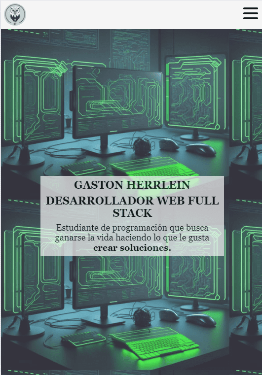
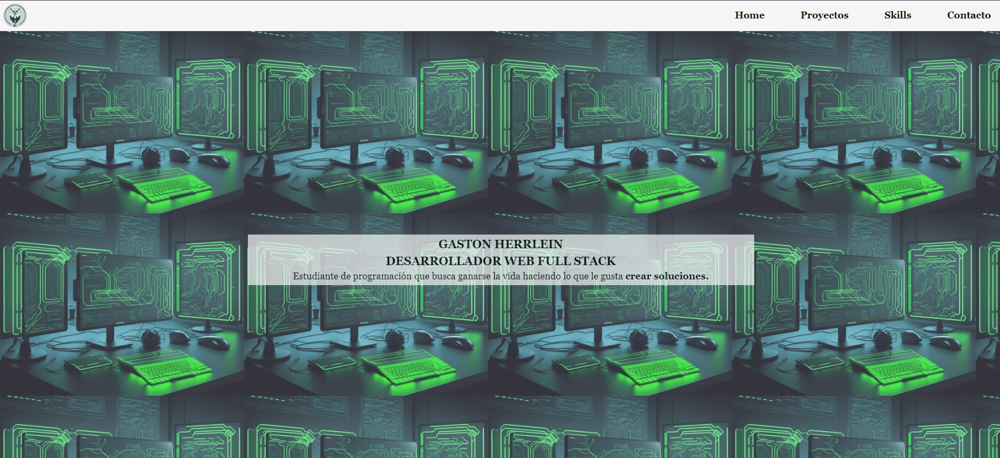
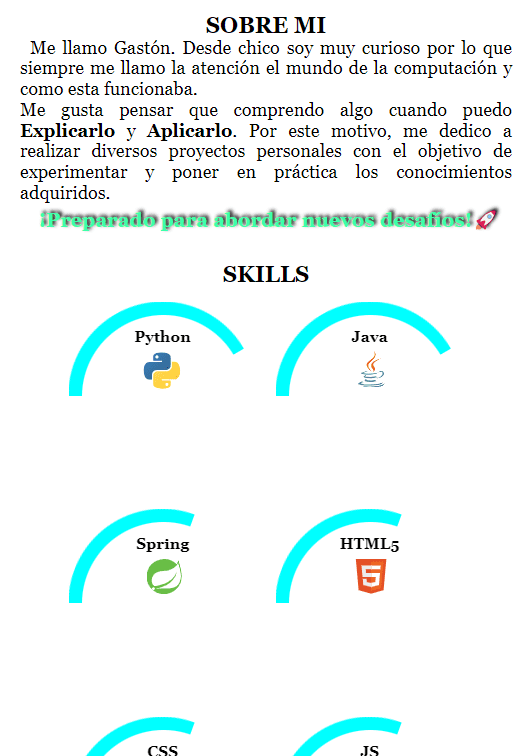
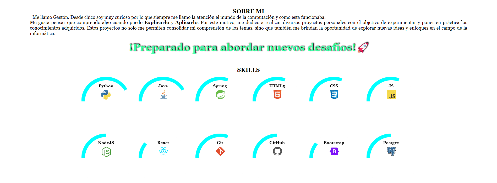
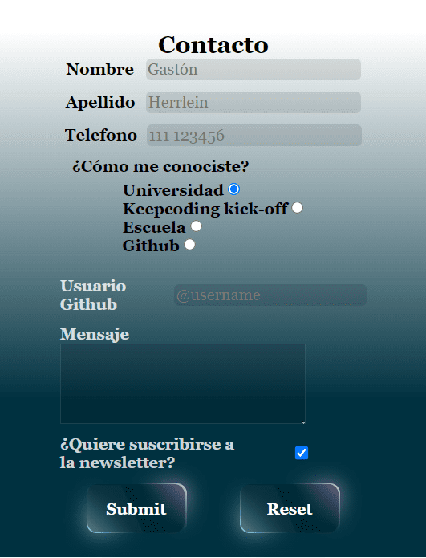
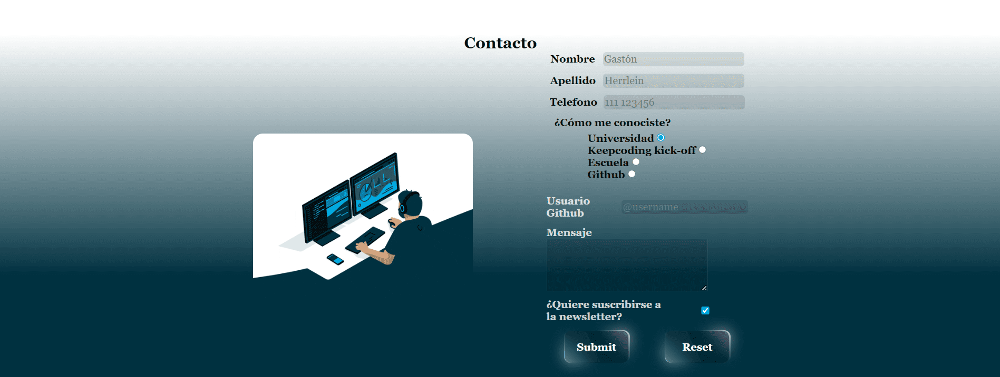

# Práctica HTML5 + CSS3 (Portfolio)

👤 Herrlein Gaston  
💻 Bootcamp Full Stack Web XVI  
📅 28 Enero 2024

Este proyecto fue creado como consigna de la practica del modulo de HTML5 y CSS3. Dicho ejercicio consistia en crear un portfolio personal utilizando puro HTML y CSS. Con la condicion de que ser MOBILE FIRST

Pagina principal: [index.html](./index.html)

Archivo css con estilos generales y medias querys: [main.css](./css/main.css)

| Versión mobile                                              | Versión Desktop                                                |
| ----------------------------------------------------------- | -------------------------------------------------------------- |
|     |     |
|  |  |
|  |  |

Pagina desplegada: ...

## Tabla de contenidos

- [Header](#header)
- [Main](#main)
- [Contact](#contact)
- [Project](#project)
- [Footer](#footer)

## Header

#### Consignas

- Crear un header con barra de navegación, la cual tiene que tener enlaces a cada elemento del portfolio
- Todos los links tendrán que tener el estado hover suavizado
- Podemos hacer un menu burger con solo CSS y un input checkbox, para no usar JS pero esto es bastante avanzado (**opcional**)

#### Resultado

Se implementa un header sencillo el cual cuenta con un brand del lado izquierdo y un navBar del lado derecho. Esto manejado con un **display flex**.

Utilizando otro **display flex** para distribuir los enlaces del navBar. Cada uno de estos links redireccionan a si sitio correspondiente de la web

Como ultimo punto se implemento un menu hamburguesa para la version mobile utilizando la propiedad checked de un input tipo checkbox.

Los estilos estan disponibles en: [nav-bar.css](./css/nav-bar.css)

## Main

#### Consigna

- Banner que deberá tener una imagen de fondo. En pantallas moviles deberá ser otra, para darle más sentido al diseño en dicha resolución.
- Sección con una descripción de nosotros y con nuestras habilidades como barras de progreso. Estas barras de progreso tienen que estar animadas con animaciones css

#### Resultado

Para este punto eh decidido utilizar un imagen en la resolucion de desktop y un recorte de la misma para mobile.

> ##### WARN!
>
> Con fines didacticos utilice la pseudo-clase `::after` a una etiqueta `
` modificando el contenido mediante la propiedad _content_ para alargar la descripcion para resoluciones mayores a 768px.
>
> Esto podria no estar del todo bien implemetado, y puede no ser la manera correcta de hacerlo, pero me parecio interesante dejarlo en el portfolio como ejemplo de esta pseudo-clase y sus usos.

Las barras de progreso las cree siguiendome de un modelo de barras animadas semi-circulares propocionado por el canal de [EDteam](https://www.youtube.com/watch?v=4BRd3cZDAT4&t=376s)

Utilizando un **display grid** para manejar la distribucion de las barras del stack

Los estilos estan disponibles en:

- [banner.css](./css/banner.css)
- [about-me](./css/about-me.css)

## Contact

#### Consigna

- Formulario de contacto con estos inputs. Todos ellos tienen que tener tanto los tipos correctos como la validación html
  - Nombre
  - Apellido
  - Telefono
  - ¿Como me conociste? (**radio input**)
  - Tag GitHub (**con regexp para validacion**)
  - Mensaje (**textarea**)
  - Botones de guardado y reset

#### Resultado

Se implementan todos los campos del formulario de contacto con un diseño un poco distinto a como venia siendo la página. Jugando con el gradiente se agrega un color de fondo de forma de integrar el fondo blanco de las skills con el azul oscuro del contacto. Intentando lograr una transicion a travez del formulario, sin perder el contraste de color de los label e inputs

Para los botones submit y reset me guie de un modelo avanzado que proporcionaba el canal de [Online Tutorials](https://www.youtube.com/watch?v=YKv3F9gcGuc). Esto con el fin de incursionar un poco mas en pseudo-clases `::before` y `::after`, ademas de practicar con selectores combinados de css para lograr estos estilos.

Los estilos estan disponibles en:

- [contact-form.css](./css/contact-form.css)
- [btn.css](./css/btn.css)

## Project

#### Consigna

- Nueva página que tenga un video que se reproduzca al entrar en la web y aparezca con una animación de fadeIn.
- En la nueva página crear un grid con nuestros proyectos.

### Resultaco

Se crea una animacion de FadeIn sencilla utilizando las propiedades de opasidad, brillo y desenfoque. Con esto logro una transicion de 2 segundos para que aparezca el video. El video utilizado es un corto configurado para que se repita en bucle.

Para la seccion de proyecto creo unas "cards" con un logo generico, titulo, descripcion e imagenes de las tecnologias utilizadas. A modo de ejemplo muestro 4 projectos que tengo en github, utilizando el titulo como enlace para redireccionar al repositorio del proyecto. Ajustando la distribucion de estos utilizando **display grid** y **media query** para las distintas resoluciones.

Los estilos estan disponibles en:

- [mq-video.css](./css/mq-video.css). En este archovo guardo la animacion fadeIn, ademas de los media query para mostrar las distintas resoluciones de video segun la resolucion de la pantalla.
- [project.css](./css/project.css)

## Footer

#### Consigna

- Footer con links a nuestras redes sociales

#### Resultado

Se implementa un footer sencillo con links a mis redes sociales. Ya que este no es mi portfolio oficial, en el correo utilizo uno ficticio para evitar spam `example@mail.com`

Los estilos estan disponibles en: [footer.css](./css/footer.css)

## RECURSOS UTILIZADOS

- [Contraste y paleta de colores]('https://coolors.co/')
